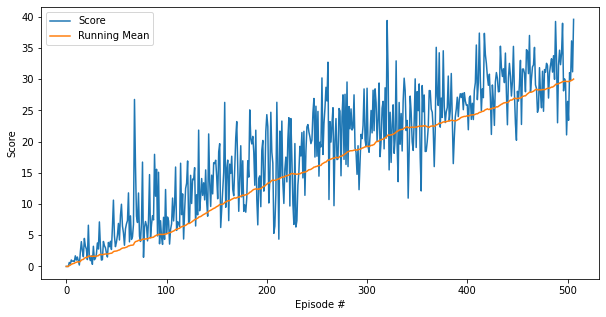

# Report for the Reacher environment using Soft Actor-Critic (SAC) algorithm

## Introduction
This report contains the results of training an agent to solve Unity's Reacher environment using the Soft Actor-Critic (SAC) algorithm. The environment is part of the Unity ML-Agents toolkit. The code is written in Python and uses PyTorch as the deep learning framework. The implementation is based on the original SAC paper by Tuomas Haarnoja et al. (2018) and the official SAC implementation by the authors. This project is part of the Udacity Deep Reinforcement Learning Nanodegree and uses the Unity environment provided by Udacity as well as the libraries and packages provided in the course. The goal of the project is to train an agent to solve the Reacher environment. The environment is considered solved when the average score over 100 episodes is at least +30. The report contains a description of the environment, the implementation of the algorithm, the results of training the agent, and possible future improvements. This project used the single agent version of the environment.

## Environment
The environment consists of double-jointed arms that can move to target locations. A reward of +0.1 is provided for each step that the agent's hand is in the goal location. Thus, the goal of the agent is to maintain its position at the target location for as many time steps as possible. The observation space consists of 33 variables corresponding to position, rotation, velocity, and angular velocities of the arm. Each action is a vector with four numbers, corresponding to torque applicable to two joints. The state space has 33 dimensions and the action space has 4 dimensions. The environment is considered solved when the average score over 100 episodes is at least +30.

## Algorithm

### Actor-Critic Methods
Actor-critic methods are a combination of value-based and policy-based methods. The actor is a policy-based method that learns the best action to take in a given state. The critic is a value-based method that learns the value of a given state-action pair. The actor and critic are trained together, and the critic provides feedback to the actor on the quality of the action taken. The actor-critic methods are known to be more stable and efficient than the individual methods.

### Soft Actor-Critic (SAC)
The Soft Actor-Critic (SAC) algorithm is an off-policy actor-critic algorithm. It is based on the maximum entropy reinforcement learning framework. The maximum entropy framework encourages the agent to explore more and learn a stochastic policy. The algorithm is designed to be sample-efficient and stable. It uses three neural networks: the actor, the two critics, and the value function. The actor is trained to maximize the expected reward and the entropy of the policy. The critics are trained to minimize the temporal difference error. The value function is trained to minimize the value error. The algorithm uses a target value network to stabilize the learning process. The algorithm also uses a replay buffer to store and sample experiences and a soft update mechanism to update the target networks.

This version of the SAC algorithm is implemented in a way that allows for gathering experiences and then looping through the experiences multiple times to update the networks. This is done to improve the sample efficiency of the algorithm. It also uses polyak averaging to update the target networks. This is done to stabilize the learning process.

The Network architecture used in this implementation is as follows:
- Actor: The actor network consists of an input layer, tw0 hidden layer with 256 and 128 units and a ReLU activation function and two output layers, one for the mean and one for the log standard deviation of the action distribution. The forward method calculates the action and the log probability of the action using the mean and log standard deviation.
- Critic: The critic networks both consists of an input layer, two hidden layer with 256 and 128 units and a ReLU activation function and an output layer with one unit. The forward method calculates the Q-value of the state-action pair.
- Target networks: the target network for the actor and the critics are created using the same architecture as the original networks. The target networks are updated using polyak averaging.

The algorithm uses the following hyperparameters:
- Discount factor (gamma): 0.99
- Learning rate (actor): 0.001
- Batch size: 64
- Tau (soft update of target networks): 0.005
- Maximum replay buffer size: 1e6
- Alpha (entropy temperature): 0.12
- Update frequency: 50

#### The Discount Factor
The discount factor is a value between 0 and 1 that determines the importance of future rewards. A discount factor of 0 means that the agent only cares about the immediate reward, while a discount factor of 1 means that the agent cares about all future rewards equally. A discount factor of 0.99 is commonly used in reinforcement learning and is used in this implementation as well.

#### The Learning Rate
The learning rate is a hyperparameter that determines the size of the step the optimizer takes when updating the network weights. A learning rate that is too high can cause the optimizer to overshoot the minimum, while a learning rate that is too low can cause the optimizer to take too long to converge. A learning rate of 0.001 is commonly used in deep learning and is used in this implementation as well.

#### The Batch Size
The batch size is the number of experiences sampled from the replay buffer to update the networks. A larger batch size can lead to more stable updates, while a smaller batch size can lead to faster updates. A batch size of 64 is commonly used in deep learning and is used in this implementation as well.

#### The Tau
The tau parameter is used to update the target networks. It determines the rate at which the target networks are updated. A smaller tau can lead to more frequent updates, while a larger tau can lead to more stable updates. A tau of 0.005 is commonly used in deep learning and is used in this implementation as well.

#### The Maximum Replay Buffer Size
The maximum replay buffer size is the maximum number of experiences that can be stored in the replay buffer. A larger replay buffer can lead to more stable updates, while a smaller replay buffer can lead to faster updates. A maximum replay buffer size of 1e6 is commonly used in deep learning and is used in this implementation as well.

#### The Alpha
The alpha parameter is the entropy temperature. It determines the importance of the entropy term in the loss function. A larger alpha can lead to more exploration, while a smaller alpha can lead to more exploitation. An alpha of 0.12 is commonly used in deep learning and is used in this implementation as well.

#### The Update Frequency
The update frequency is the number of steps the agent takes before updating the networks. A larger update frequency can lead to more stable updates, while a smaller update frequency can lead to faster updates. An update frequency of 50 is commonly used in deep learning and is used in this implementation as well.

## Results
The agent was able to solve the environment in 507 episodes. The average score over 100 episodes was +30.07. The plot below shows the scores of the agent over the episodes and the running average of the scores.

## Future Improvements
The implementation of the SAC algorithm can be improved in several ways: 
- The hyperparameters can be tuned to improve the performance of the agent. 
- The network architecture can be modified to improve the learning process.
- The algorithm can be modified to use parallel environments to improve the sample efficiency.
- We can also use a distributed version of the algorithm to improve the learning process.
- The algorithm can be modified to use a prioritized experience replay buffer to improve the learning process.
- The algorithm can also be modified to use a more sophisticated exploration strategy to improve the learning process.

In fact, experiments with the 20-agent version of the environment showed that a parrallelized version DDPG only took 105 episodes to solve the environment. Although the wall-clock time was much higher without a GPU, the sample efficiency was better. This suggests that the SAC algorithm can be improved by using parallel environments.

## Conclusion
The Soft Actor-Critic (SAC) algorithm was able to solve the Reacher environment in 507 episodes. The agent was able to achieve an average score of +30.07 over 100 episodes. The implementation of the algorithm can be improved in several ways to achieve better performance. The algorithm is known for its sample efficiency and stability and is a good choice for solving continuous control problems. The algorithm can be used to solve other continuous control problems and can be modified to improve its performance.